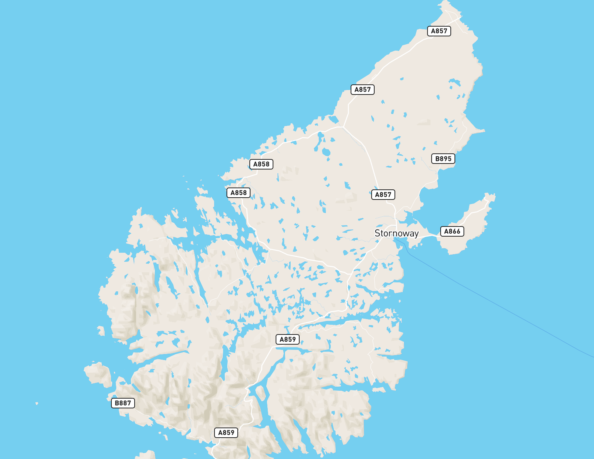

# mapbox-map-image-export

> :warning: This tool is experimental. :warning:

A command-line tool to export a [Mapbox vector map][1], such as one created with [Mapbox Studio][2], to a high-resolution image for printing etc.

Mapbox has a [Maps static API][3] for exporting images, but it is limited to `1280px`, and exports as jpeg, with visible compression artifacts. `mapbox-map-image-export` renders the map in a headless browser and exports by default to uncompressed png. You can adjust the dpi setting for high-quality printing. `144dpi` (the default) is good enough for most print applications, but if you want better quality try `288dpi`. Icons will be 144dpi (retina) due to the way sprites are handled by `mapbox-gl-js`.

The Mapbox [wmts service][4] is another option for creating maps for printing in QGIS or ArcMap, but it does not currently support retina maps, so is limited to printing at around 72dpi, and is also only jpeg right now.

[1]: https://www.mapbox.com/maps/
[2]: https://www.mapbox.com/mapbox-studio/
[3]: https://www.mapbox.com/api-documentation/#static
[4]: https://www.mapbox.com/help/mapbox-arcgis-qgis/

```sh
export MAPBOX_TOKEN=pk.eyJ1IjoidGF0aWFuYSIsImEiOiJjaWs1bzRiZGQwMDdjcHRrc285bTdwcWU5In0.0EWPVHyjaE9jTzNvOiIO-w

export-map mapbox://styles/mapbox/streets-v9 -w=11in -h=8.5in \
  -b=-7.1354,57.9095,-6.1357,58.516 -t=$MAPBOX_TOKEN -o=lewis.png
```



## Install

This tool uses Electron to render the map using [mapbox-gl-js][3], so it is fairly heavy (~100mb). Install with latest [npm](https://www.npmjs.com/).

[5]: https://www.mapbox.com/mapbox-gl-js/api/

```sh
npm install mapbox-map-image-export -g
```

## Usage

```txt
Usage:
  export-map mapboxStyleUrl

Options:
  --bounds, -b      comma-separated bounding box [required] 'minLon,minLat,maxLon,maxLat' eg. '-7.1354,57.9095,-6.1357,58.516'
  --token, -t       Mapbox API token [required]: https://www.mapbox.com/studio/account/tokens/
  --output, -o      image output path, optional, defaults to std.out
  --dpi, -d         dpi of output image, default 144dpi (equivalent to how the map renders on a retina screen)
  --format, -f      output format, "jpg", "webp" or "png" (default)
  --quality, -q     encoding quality for jpg and webp, default 0.9
  --width, -w       output width for printing e.g. 11in or 297mm
  --height, -h      output height for printing
```

Exports a map for a given mapbox style url for the specified bounding box.

If no `--output` is given, the PNG is written to stdout.

## What does 'dpi' mean?

Mapbox Studio and Mapbox GL maps are designed for the screen, as such 'dpi' (dots per inch), a print term, does not have any real meaning. However, the standard screen resolution is equivalent to between 72 and 96dpi (e.g. 72 screen pixels will measure approximately 1 inch on a standard screen). Mapbox GL maps are designed by zoom level, and this tool assumes you want maps to look on paper roughly the same as they look on screen at the same size. `mapbox-map-image-export` assumes a standard resolution mapbox map is 72dpi, and a retina (@2x) map is 144dpi. You can set 288dpi if you like, and this will render as if to an ultra-retina screen with a devicePixelRatio=4. Keep dpi to a multiple of `72` if you want icons to look good.

## Limitations

Due to a [bug in mapbox-gl-js][6] trying to export an image that is larger than 2000px width or height may not work correctly - it will not export the bounds that you expect it to.

[6]: https://github.com/mapbox/mapbox-gl-js/issues/2863

## Acknowledgements

This is inspired by [extract-streetview](https://github.com/Jam3/extract-streetview) by [mattdesl](https://github.com/mattdesl). It uses [Jam3/devtool](https://github.com/Jam3/devtool) to run [electron](http://electron.atom.io) to render the map in a headless version of Chrome.

## License

MIT
